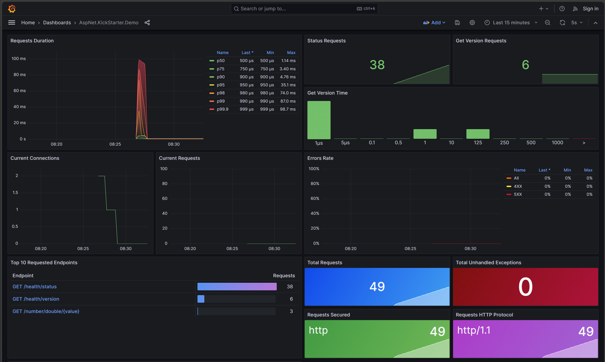
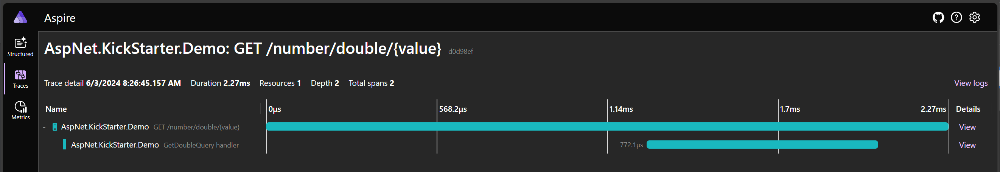
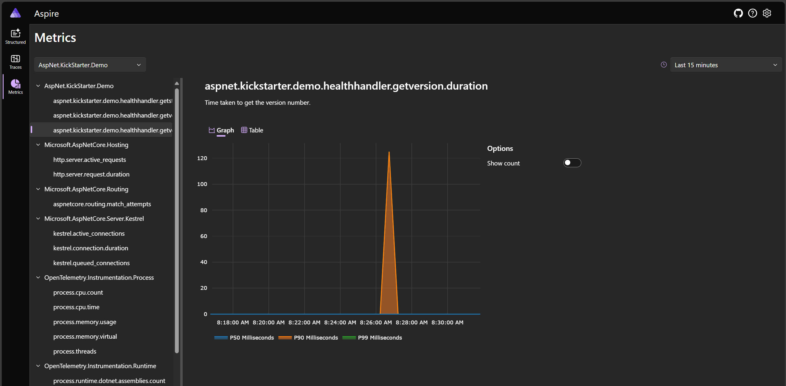
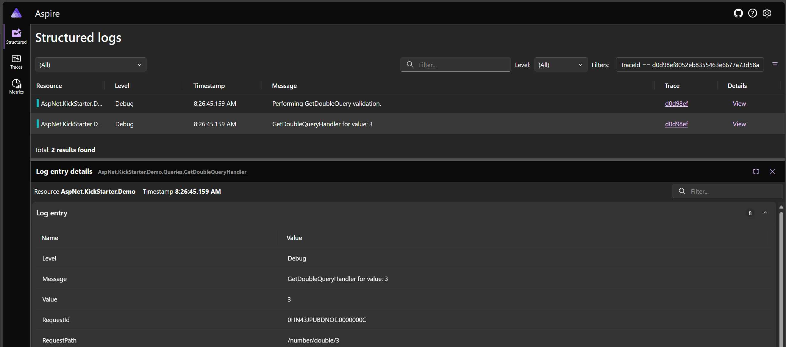

# AspNet.KickStarter

The packages in this repository provide small helpers to reduce the repetitive code used to run AspNet Minimal API projects.

Starting with the `ApiBuilder` class extra functionality can be included using the AddIn extensions.

### ApiBuilder

The most basic use in a Program.cs file would be
```csharp
await new ApiBuilder().Build(args).RunAsync();
```

For something more visible, add Swagger and some endpoints:
```csharp
await new ApiBuilder().WithSwagger().WithHealthHandler().Build(args).RunAsync();
```

Many fluent extension methods are available through the AddIn packages to add extra functionality. Each extension may provide additional configuration parameters.

Further information about the extensions may be found in the readme for the AddIn package. See the projects in [source](src) for the full list of AddIns.

```csharp
await new ApiBuilder()
    .WithSerilog()
    .WithSwagger()
    .WithHealthHandler()
    .WithServices(builder => {...})
    .WithEndpoints(app => {...})
    .WithMappings(() => {...})
    .WithOpenTelemetry()
    .WithFluentValidationFromAssemblyContaining<T>()
    .WithAdditionalConfiguration(builder => {...})
    .Build(args)
    .RunAsync();
```

# AspNet.KickStarter.CQRS

This library provides interfaces used to implement CQRS with MediatR

* `ICommand` and `ICommandHandler`
* `IQuery` and `IQueryHandler`

These commands and queries rely on `Result`, `Result<T>` and `Error` types from the `AspNet.KickStarter.FunctionalResult` library

## TracePipelineBehavior

The library provides a generic `TracePipelineBehavior` class that adds automatic trace activities for any commands or queries.

## ValidationPipelineBehavior

The library also provides a generic `ValidationPipelineBehavior` class that enables use of FluentValidation for any commands or queries with a corresponding validator class.

# AspNet.KickStarter.Demo

The demo project illustrates much of the functionality provided by AspNet.KickStarter.

It adds Swagger, Serliog logging, health endpoints, as well as CQRS with OpenTelemetry traces for the query handler.

## AspNet.KickStarter.Demo.DockerCompose

This showcases the OpenTelemetry metrics and traces in action.






