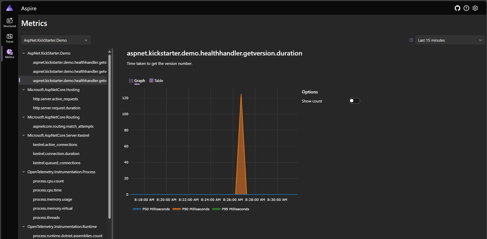

# AspNet.KickStarter.Demo

The demo project here illustrates much of the functionality provided by AspNet.KickStarter.

It adds Swagger, Serliog logging, health endpoints, CQRS with OpenTelemetry traces for the query handler.

## AspNet.KickStarter.Demo.DockerCompose

This showcases the OpenTelemetry metrics and traces in action.

